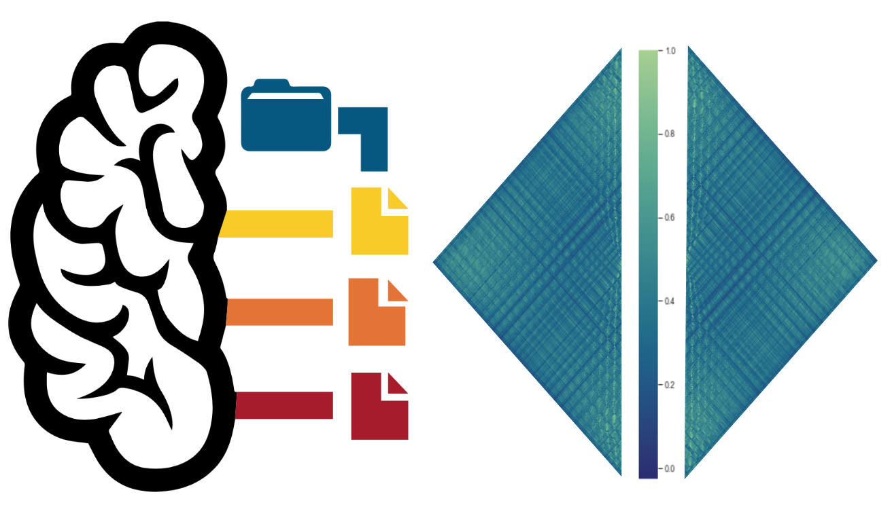

.. centered:: bids_relmat: A short description of your python package.

.. image:: https://github.com/peerherholz/bids_relmat/actions/workflows/docs.yml/badge.svg
        :target: https://github.com/peerherholz/bids_relmat/actions/workflows/docs.yml
 
.. image:: https://img.shields.io/pypi/v/bids_relmat.svg
        :target: https://pypi.python.org/pypi/bids_relmat

.. image:: https://img.shields.io/docker/pulls/peerherholz/bids_relmat
    :alt: Dockerpulls
    :target: https://cloud.docker.com/u/peerherholz/repository/docker/peerherholz/bids_relmat

.. image:: https://img.shields.io/github/repo-size/peerherholz/bids_relmat.svg
        :target: https://github.com/peerherholz/bids_relmat.zip

.. image:: https://img.shields.io/github/issues/peerherholz/bids_relmat.svg
        :target: https://github.com/peerherholz/bids_relmat/issues

.. image:: https://img.shields.io/github/issues-pr/peerherholz/bids_relmat.svg
        :target: https://github.com/peerherholz/bids_relmat/pulls

.. image:: https://img.shields.io/github/license/peerherholz/bids_relmat.svg
        :target: https://github.com/peerherholz/bids_relmat

|

Introduction
============

``bids_relmat`` aims to provide a set of tools for the conversion of ``BIDS`` derivatives datasets containing relationship matrices
to be compliant with the ``relationship matrix`` extension. 

This documentation showcases the respective functionality and provides details concerning
its application and modules.
If you still have questions after going through provided here you can refer to 
the :ref:`api_ref` or ask a question on `GitHub <https://github.com/peerherholz/bids_relmat/issues>`_.

Contents
========
.. toctree::
   :maxdepth: 1

   installation
   usage
   relmat_file
   walkthrough
   auto_examples/index
   api_ref
   release-history
   min_versions
